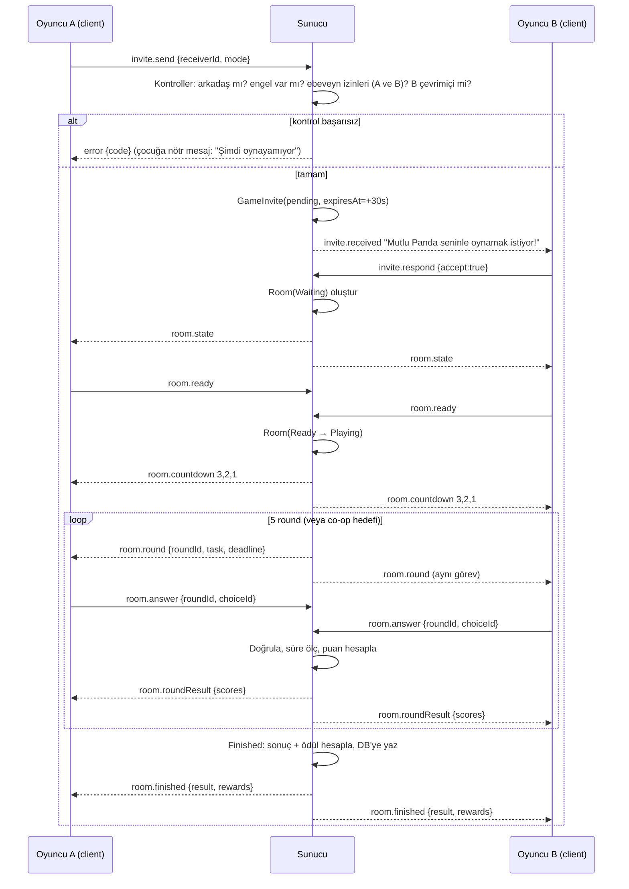
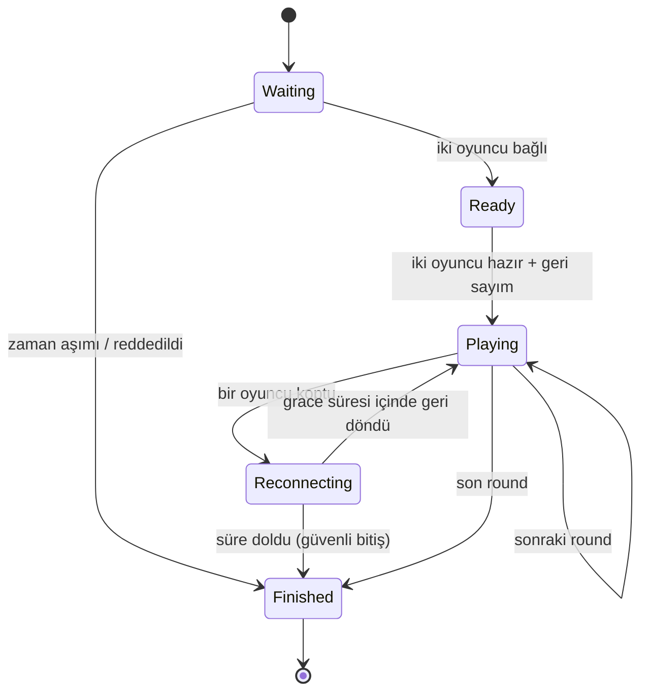

# 5. Multiplayer Akış Diyagramı

## 5.1 Davet → Oda → Maç

## 5.2 Oda Durum Makinesi

## 5.3 Round Sırası (Rekabet Modu)
1 Renk → 2 Şekil → 3 Sayı → 4 Hafıza → 5 Puzzle (15-30 sn)

## 5.4 Co-op ("Birlikte Başaralım")
Sunucu ortak hedef sayacı tutar (`teamTarget=10`). İki oyuncunun doğru cevapları toplanır. Hedef dolunca `Finished(success)`; süre dolarsa "Çok yaklaştınız!" ve yine takım ödülü verilir (daha az).

## 5.5 Exploit Kontrolleri
| Risk | Önlem |
|---|---|
| Sahte skor | Skor sadece sunucuda hesaplanır |
| Hız hilesi (anında cevap) | Sunucu round başlangıç zamanından süre ölçer; insan altı süre (config `minHumanResponseMs`) hız bonusunu sıfırlar |
| Aynı round'a çoklu cevap | Round başına ilk cevap geçerli, sonrası yok sayılır |
| Başkasının odasına girme | JWT oyuncu ID ↔ oda üyeliği kontrolü |
| Mesaj taşkını | Rate limit + hazır mesaj aralık sınırı |
| Replay / eski round | `roundId` eşleşmeli |
| Davet spam | Gönderen başına bekleme + aynı alıcıya bekleyen davet limiti |
| Kopma sömürüsü | Kopan oyuncu cezalandırılmaz, kazanan da hileyle kazanamaz: erken bitişte eşit minimum ödül |
