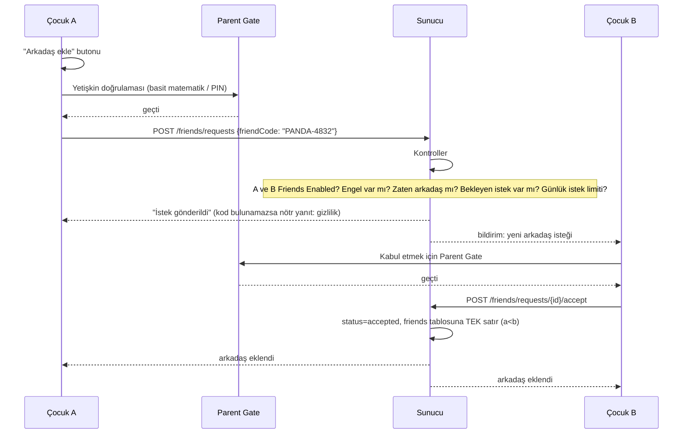

# 6. Arkadaşlık Sistemi Akışı

## Durum Makinesi
`pending → accepted | rejected | expired`  (expiresAt = +7 gün, `pending` olanlar süre dolunca `expired`)

## Kurallar
1. **Yalnızca arkadaş kodu** ile arama. Kullanıcı adı ile arama yok (tahmin/taciz önleme).
2. Kod bulunamadığında ve ebeveyn izni kapalı olduğunda **aynı nötr yanıt** döner (hesap varlığı sızdırılmaz).
3. Aynı kişiye mükerrer pending istek yok; karşı taraf zaten bana istek yollamışsa otomatik kabul **yapılmaz**, bekleyen istek gösterilir.
4. Reddedilen isteğe 24 saat tekrar istek yok.
5. Engel, mevcut arkadaşlığı ve bekleyen istek/davetleri iptal eder.
6. Ebeveyn panelinde: gelen istekler, arkadaş listesi, kaldırma, engelleme.
7. `Friends Enabled = OFF` → liste gizli, istek/davet reddedilir, presence yayınlanmaz.
8. Arkadaş kodu formatı: `HAYVAN-1234` (kolay okunan, karışık harf yok: `O/0`, `I/1` hariç), ebeveyn "kodu yenile" yapabilir.
